# Portal de Cartera y Comisiones — CM&M Holding

Portal interno de Business Intelligence para la gestión de cartera, facturación y comisiones de un holding de corretaje de seguros. Centraliza en una sola aplicación lo que antes vivía disperso en decenas de hojas de Excel.

Podés verlo en funcionamiento en las [capturas](#capturas), o levantarlo en local en dos comandos — el modo demo no necesita base de datos ni credenciales.

> ### ⚠️ Demo con datos ficticios
> Este repositorio es una **versión de demostración**. Todos los datos —empresas, clientes, NITs, aseguradoras y cifras— son **generados artificialmente**. No contiene información real de la empresa ni de sus clientes.
> El modo demo (`PORTFOLIO_DEMO_MODE`) desactiva Supabase por completo y sirve datos fabricados.

---

## El problema

La gestión de cartera y comisiones dependía de consolidados manuales en Excel. Cada cierre implicaba:

- Buscar y consolidar planillas de comisiones de **múltiples aseguradoras y ARL**.
- Cruzarlas contra la facturación de **3 empresas del holding**.
- Armar a mano los reportes para Gerencia y Presidencia.

Volcar las facturas y planillas a los consolidados podía tomar **hasta 2 días**, sin visibilidad en tiempo real del estado de la cartera.

## La solución

Este portal hace que esa información se cargue, cruce y visualice sola:

- **Automatización de ingesta**: scripts en Python que leen y consolidan **40–60 facturas mensuales** desde PDF y Excel.
- **Estado en tiempo real** de la facturación: pagadas, pendientes y anuladas.
- **Dashboards ejecutivos** con indicadores, proyección de ingresos y comportamiento por aseguradora.
- **Alertas operativas**: planillas atrasadas, mora crítica y concentración de deuda.

El proceso de consolidación pasó de **días a minutos**.

---

## Módulos

| Módulo | Qué hace |
|---|---|
| **Resumen General** | Vista ejecutiva del holding: facturación, recaudo, cartera vencida y proyección al cierre. |
| **Control ARL** | Analítica de comisiones ARL por año, aseguradora, ciudad y empresa. Vista bruta/neta y P&G de rentabilidad. |
| **Control Seguros** | Comisiones, primas y pólizas por cliente y aseguradora, con tendencia mensual. |
| **Cartera** | Control de facturación, antigüedad de cartera, top deudores y seguimiento de planillas. |
| **Análisis Cartera** | Aportes por cliente, comparativos e ingresos. |
| **Directorio** | Contactos y portales de las aseguradoras. |
| **Usuarios** | Administración de accesos, roles y permisos por módulo. |

## Características destacadas

- **Autenticación y permisos por rol** — JWT en cookie httpOnly, validado en middleware del lado servidor. Cada usuario ve solo los módulos habilitados; las rutas de administración quedan restringidas a `admin`.
- **Asistente de IA** — consulta de los datos del portal en lenguaje natural (Gemini). _En esta demo la respuesta es simulada: no se llama a ningún servicio externo._
- **Dashboards interactivos** — Chart.js con filtros por año, mes, empresa y modo bruto/neto.
- **Responsive y PWA** — pensado para consultarse desde el móvil.
- **Tres temas** — claro, medio y oscuro.
- **Trazabilidad** — auditoría de eventos y flujo de aprobaciones.

## Stack

**Frontend:** Next.js 14 (App Router) · React 18 · TypeScript · Tailwind CSS · Chart.js
**Backend:** Next.js API Routes · Supabase (PostgreSQL, Auth) · JWT (`jose`)
**Datos:** Python para la ingesta y consolidación desde Excel/PDF · JSON precomputados

## Decisiones técnicas

- **Autorización en el middleware.** La validación de rol y permisos ocurre en el borde (`middleware.ts`), antes de renderizar, en vez de dentro de cada página.
- **JSON precomputados para la analítica.** Las vistas de ARL y Seguros se alimentan de agregados calculados en Python, no de consultas en vivo. Los dashboards abren al instante aunque el histórico tenga decenas de miles de registros.
- **Modo demo aislado** (`lib/env.ts`). Un solo flag desactiva Supabase y sustituye la capa de datos, lo que permite publicar el portal sin exponer información real.

---

## Correr en local

```bash
npm install
cp .env.example .env.local   # configurar variables
npm run dev
```

### Modo demo (sin base de datos)

```env
PORTFOLIO_DEMO_MODE=true
```

Con ese flag no se necesita Supabase ni credenciales: la app sirve datos ficticios y omite el login.

---

## Capturas

### Resumen General
Vista ejecutiva del holding: facturación, recaudo, cartera vencida y alertas operativas, con comparativo contra el periodo anterior y proyección al cierre.

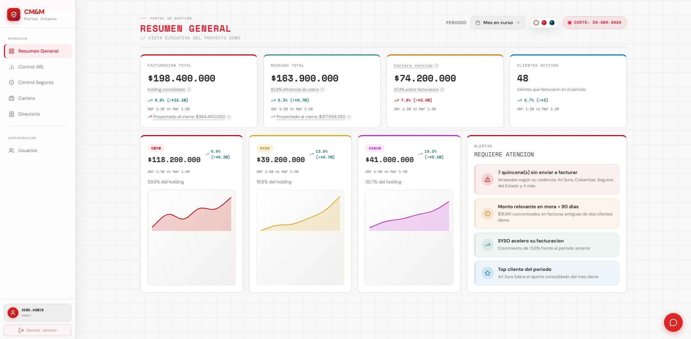

### Control ARL
Analítica de comisiones por año, aseguradora y ciudad, con vista bruta/neta y P&G de rentabilidad.

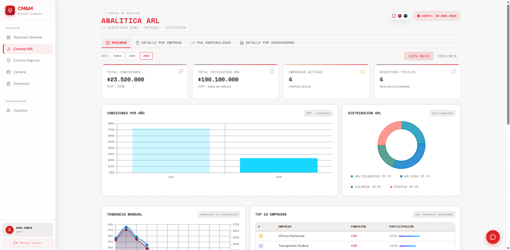

### Cartera
Antigüedad de cartera, eficiencia de cobro, top deudores y estado de planillas.

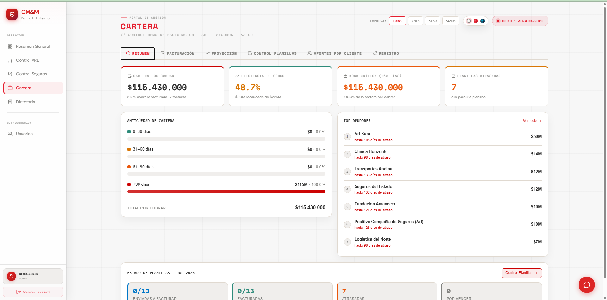

### Control Seguros
Comisiones, primas y pólizas por cliente y aseguradora, con tendencia mensual.

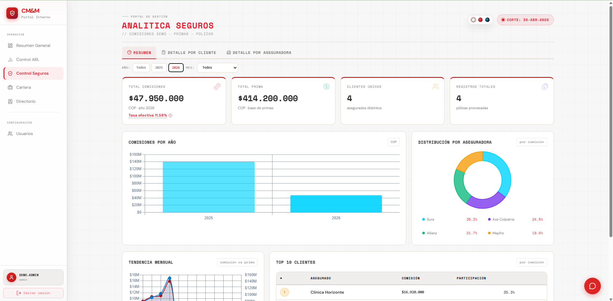

<details>
<summary><b>Ver más vistas</b> — facturación, proyección, planillas, registro, aportes, directorio y usuarios</summary>

<br>

**Cartera · Facturación** — control de facturas emitidas, estados y recaudo.
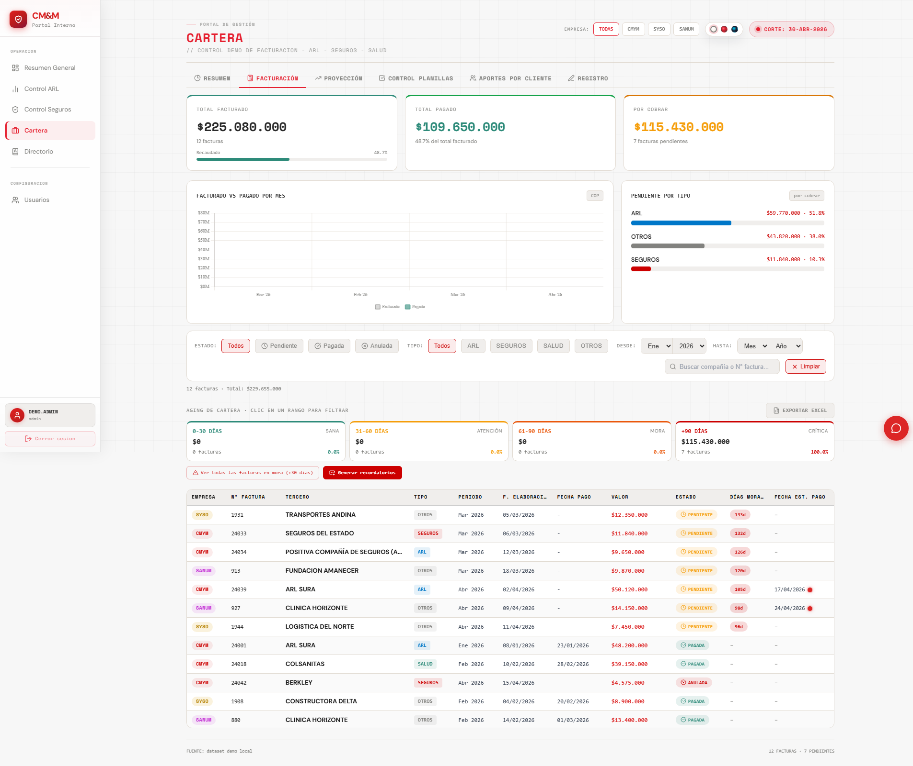

**Cartera · Proyección** — proyección de ingresos por compañía, con estabilidad y variación.
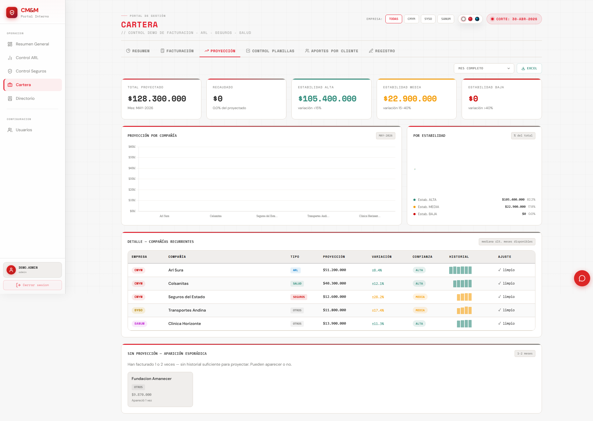

**Cartera · Control de planillas** — seguimiento de planillas por quincena y alertas de atraso.
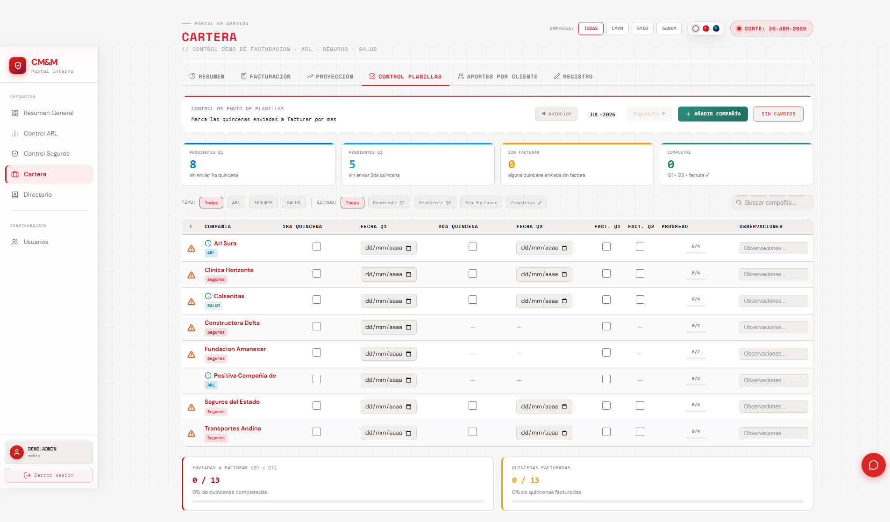

**Cartera · Registro** — registro y edición de movimientos.
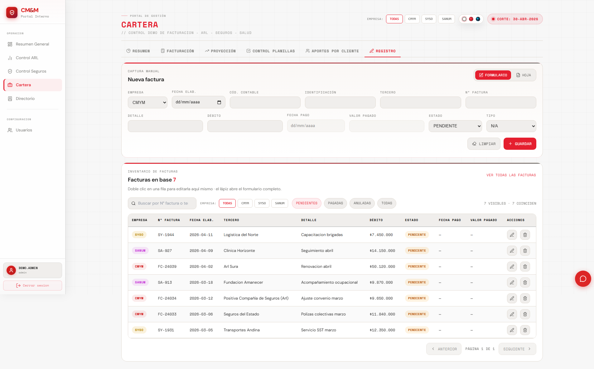

**Cartera · Aportes por cliente** — contribución de cada cliente al consolidado.
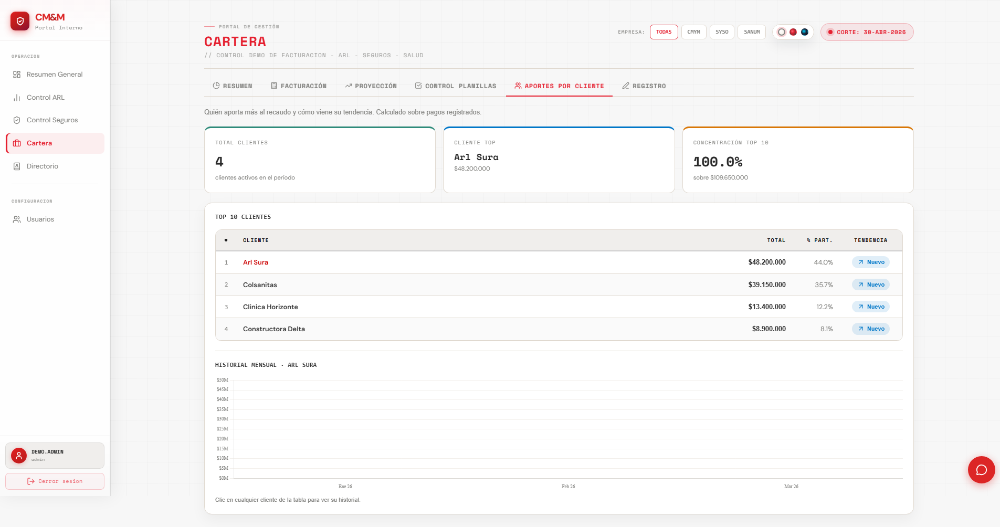

**Directorio** — contactos y portales de las aseguradoras.
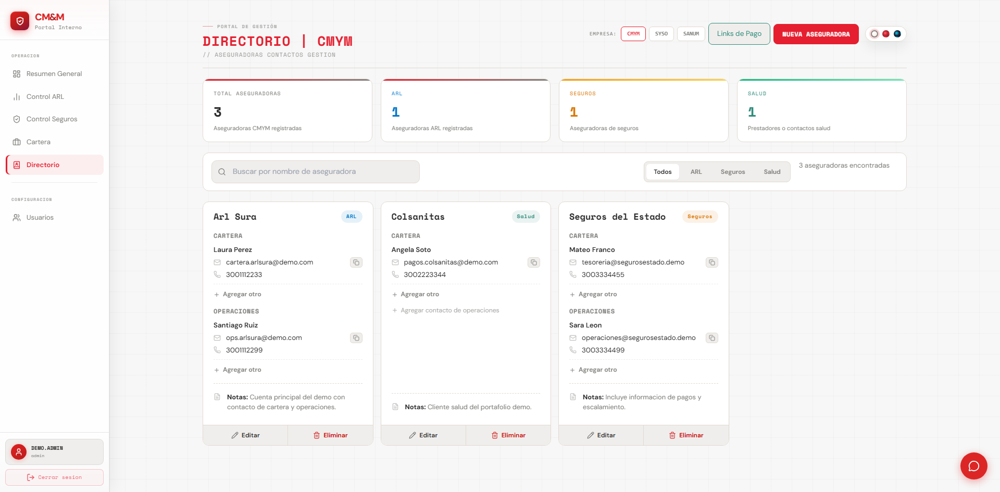

**Usuarios** — administración de accesos, roles y permisos por módulo.
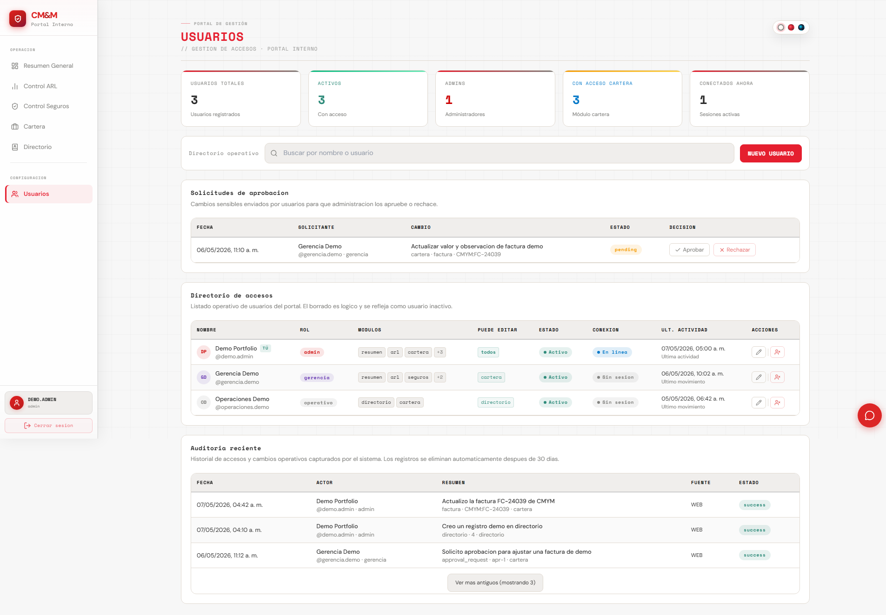

</details>

---

**Autor:** Jackser Barcelo — [LinkedIn](https://www.linkedin.com/in/jackser-junior-barcelo-ariza-a19327149/) · [GitHub](https://github.com/janier14)
